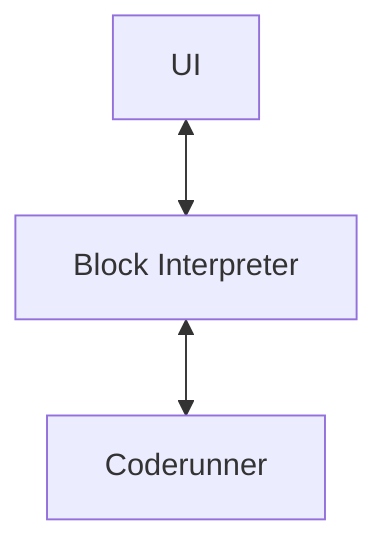

<div style="display: flex; justify-content: center;" align="center">
    <h1>Visual Java</h1>
</div>
<div style="display: flex; justify-content: center;" align="center">
    by Matthew Tsai, Allen Wei and Steven Chen
</div>

# 目錄
<!-- TOC -->
* [目錄](#目錄)
* [簡介](#簡介)
* [編譯與執行](#編譯與執行)
* [使用說明](#使用說明)
  * [介面](#介面)
  * [操作](#操作)
* [架構](#架構)
  * [示意圖](#示意圖)
  * [技術說明](#技術說明)
    * [後端 by 魏絃恩](#後端-by-魏絃恩)
      * [`Step`](#step)
      * [`Store`](#store)
      * [`Condition`](#condition)
      * [`ExecutionContext`](#executioncontext)
    * [前端 by 蔡宇修、陳鴻治](#前端-by-蔡宇修陳鴻治)
      * [選色](#選色)
      * [積木](#積木)
      * [工作區](#工作區)
* [其他](#其他)
  * [開發環境](#開發環境)
  * [AI 使用揭露](#ai-使用揭露)
  * [分工](#分工)
<!-- TOC -->

# 簡介
此為由蔡宇修、魏絃恩、陳鴻治為了計算機實習的期末專案，而開發的視覺化程式學習軟體。
使用者**無需自己編寫任何程式碼**，僅需拖曳、排序積木，即可輕鬆設計自己的程式邏輯。


# 編譯與執行
本專案使用 Gradle 9.5.0 做為建置工具，專案中亦有 `gradlew` 可使用。
1. 確保已安裝 JDK 24.0.2，並確定安裝路徑。
    - JDK 24.0.1 於開發時測試亦可運作，但仍建議使用 24.0.2。
2. 開啟終端機，並將工作路徑 (working directory) 改至此專案內：
    ```shell
    cd <PATH_TO_PROJECT>/VisualJava
    ```
3. 執行 Gradle指令：
    ```shell
    ./gradlew run
    ```
即可自動建置並執行。
若上述方法執行失敗，於 GitHub 的儲存庫亦有預先打包的 JAR 檔，可於 [Releases](https://github.com/Alllen95Wei/VisualJava/releases) 下載。

# 使用說明
## 介面
- **左側：積木選擇區**，使用者可從此處拖曳新積木至*工作區*。\

- **中心：工作區**，使用者於此處排列、連線積木，組合自己的程式邏輯。\

- **右側：執行結果區**，未執行時顯示*工作區*狀態，執行時顯示執行結果或錯誤訊息。\


## 操作
- 對*積木選擇區*的積木按住滑鼠左鍵後拖曳，即可產生新積木。\
  
- 積木間需要建立「連線」建立先後關聯/參數連接。
  對節點按住左鍵，即可拉出連線；將連線的尾端拉至接受端點後放開，即可建立連線。
> [!NOTE]
> **節點的類型：**
> - :black_circle: 黑色：接下來要執行的積木。
> - :large_blue_circle: 藍色：參數積木。
> - :white_circle: 白色：接受連線的端點，無法拉線。
  
  
- 如要移除積木，使用左鍵快速連擊該積木 2 下即可移除。\
  


# 架構
本專案採「前後端分離」開發，由魏絃恩負責後端執行引擎 (`Coderunner`)、蔡宇修和陳鴻治負責前端 UI。

## 示意圖

## 技術說明
以下針對前後端的運作原理，搭配 Java 原始碼分別說明。

### 後端 by 魏絃恩
專案開始時，我以 Java 的程式碼結構作為出發點，並進行了分類。經過簡單的規劃後，決定以不同的物件模擬程式語言的常見元素：
- 函式：`Step`
- 變數：`Store`
- 判斷式：`Condition`

此外，為了能實作執行環境內變數的調用，因此額外定義了 `ExecutionContext` 用於跨物件共享資料 (`Store`)。

以下說明各物件的定義與實作。

#### `Step`
`Step` 介面中，定義的規格需有 `void execute()` 及 `void execute(ExecutionContext context)` 的實作。
執行時，引擎應呼叫 `execute()` 並提供目前環境的 `context` 以便調用變數。

常用的 `Step` 如下：
- `PrintStep`：為 `System.out.print(f/ln)` 的 `Step` 實作，作為此引擎唯一的輸出方式。
- `AddStep`：為算術加法的 `Step` 實作。減/乘/除法亦有對應實作。

某些特殊的操作也使用 `Step` 實作，如：
- `Flow`：此物件可容納並依序執行多個 `Step`，可用於 if-else 及迴圈內；使用者所建構的程式亦會以 `Flow` 盛裝、執行。
- `SetStep`：此物件用於設定 `Store` 的值，用途相當於
    ```java
    Number num = 1;
    // or
    num = 2;
    ```
- `IfStep`：此物件依給定 `Condition` 的結果 (True/False) 不同，執行不同的 `Flow`。

#### `Store`
`Store` 的介面在設計時，以「Java Bean」為啟發，將值以 `private` 方式儲存於物件內，再以 `get()`、`put()` 供其他物件存取值。
為了簡化開發流程，專案內僅實作了 2 種 `Store`，分別為 `NumberStore` 及 `StringStore`。

#### `Condition`
`Condition` 的介面僅要求了 `boolean evaluate(ExecutionContext context)` 的實作。欲取得結果時，應呼叫 `evaluate()` 並提供目前環境的 `context` 以便調用變數。

已實作的 `Condition` 如下：
- `GreaterThanCondition`：建構子需要 2 個參數，可填入 `String` 或 `Number`，共 4 種組合。若填入 `String`，則會視為是變數名稱，並先至 `context` 內查詢對應值再行比較。其餘如大於等於/小於等 4 種比較運算子亦有實作。
- `And/Or/NotCondition`：用於比較 2 個 `Condition` 的關係。

#### `ExecutionContext`
`ExecutionContext` 是為了能跨物件共享 `Store` 而存在。設計時，為了避免直接將執行環境暴露，參考了虛擬環境的概念而設計了此物件。

### 前端 by 蔡宇修、陳鴻治
我們以簡單的主題設計前端介面，希望能帶給使用者好上手又迅速的介面。

#### 選色
我們以淺藍色作為主題色，包含字體、按鈕、背景等皆採用同色系設計。~~背景有漸層絕對不是跟 AI 學的。~~\


#### 積木
我們採取類似「流程圖」的設計，對於不同類型的積木，我們設計了不同形狀：
- **開始**：圓角矩形
- **一般流程**：矩形
- **如果**：菱形
- **判斷式**：六角形
- **變數與值**：橢圓形

最初，我們僅以顏色做出視覺上的強烈區別；但考慮到使用者可能會有色弱等辨色能力異常情況，因此加上了形狀差異。

#### 工作區
我們在測試時，發現當積木數量增加，積木經常會溢出工作區；因此，我們加上了可捲動的設計，增加放置積木的空間。

# 其他
## 開發環境
- JDK：Oracle OpenJDK 24.0.2
- IDE：JetBrains IntelliJ IDEA 2026.1.2
- JavaFX：JavaFX 26
- 建置工具：Gradle 9.5.0
  > Maven 實在用不習慣，因此用了 Gradle
- 版本控制：Git + GitHub

## AI 使用揭露
在發想主題、開發專案的過程中，我們使用了 AI 工具協助我們推展進度、激發創意，或是實作我們無法達到的功能。\
我們使用的工具包含：
- ChatGPT
- Google Gemini
- GitHub Copilot

## 分工
| 成員 | 職責 | 貢獻度 |
| --- | --- |-----|
| 蔡宇修 | 前端、美術設計 |     |
| 魏絃恩 | 後端、專案管理、書面報告 |     |
| 陳鴻治 | 前端、DEMO 規劃 |     |
